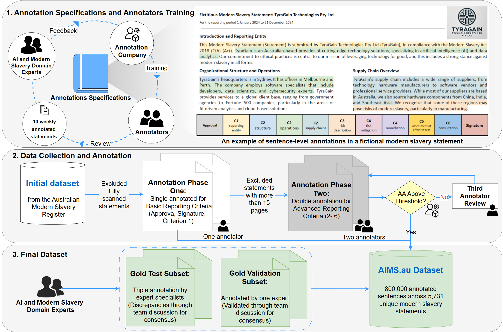
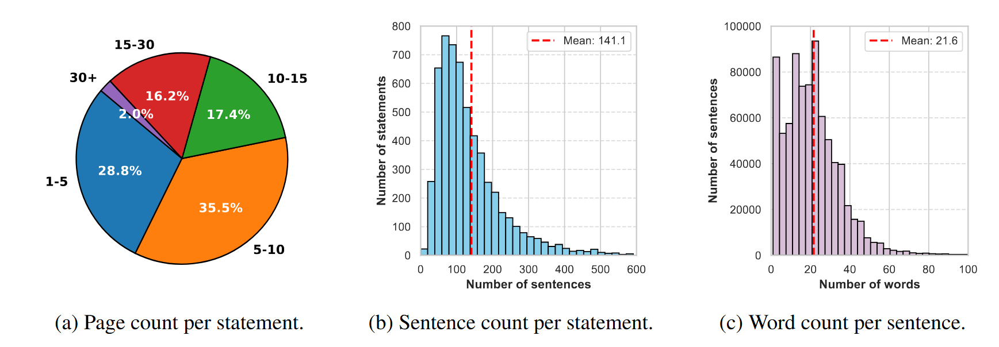

# AIMS.au — A Dataset for the Analysis of Modern Slavery Countermeasures in Corporate Statements

<p align="left">
  <a href="https://arxiv.org/abs/2502.07022"></a>
  <a href="https://iclr.cc/"></a>
  <a href="https://huggingface.co/datasets/mila-ai4h/AIMS.au"></a>
  <a href="../../LICENSE"></a>
</p>

**Venue:** ICLR 2025 · **Paper:** [arXiv:2502.07022](https://arxiv.org/abs/2502.07022)

Adriana Eufrosina Bora¹², Pierre-Luc St-Charles¹, Mirko Bronzi¹, Arsène Fansi Tchango¹, Bruno Rousseau¹, Kerrie Mengersen²

<sub>¹ Mila — Quebec AI Institute · ² Queensland University of Technology</sub>

← [Back to Project AIMS](../../README.md)

---

## Overview

AIMS.au is the most extensive open dataset of modern slavery statements annotated against the
mandatory criteria of the Australian Modern Slavery Act. It supports both the analysis of
corporate disclosure practices and the evaluation of language models on compliance assessment.

The central problem it addresses: statements are long, hedged, and written to sound compliant.
Deciding whether a given sentence constitutes actual evidence of a required disclosure — rather
than aspirational language about it — requires close reading against the legislation. AIMS.au
captures that judgement at sentence level, at scale, from human annotators and domain experts.

## Key features

- **Coverage** — over **5,700** statements from the [Australian Modern Slavery Register](https://modernslaveryregister.gov.au/), spanning **7,270** entities from **2019 to 2023**
- **Annotations** — over **800,000** labelled sentences
  - Basic criteria (approval, signature, entity identification): single-annotated
  - Complex criteria requiring nuanced interpretation: double-annotated across 4,657 statements
- **Gold standard subsets** — two expert-annotated subsets of **50** statements each, for
  high-reliability evaluation

## Dataset structure

Three annotation levels, intended for distinct purposes:

1. **Annotated dataset** — model training
2. **Gold subset, single expert validation** — model validation
3. **Gold subset, triple-expert consensus** — model testing (highest trust)



### Criteria mapping

How the Australian MSA mandatory criteria correspond to the annotation questions in AIMS.au,
with illustrative (fictitious) examples:


### Statistics

Text distribution across the 5,731 statements:



## Access

| Resource | Location |
|---|---|
| Dataset | [Figshare DOI 10.6084/m9.figshare.28489340](https://doi.org/10.6084/m9.figshare.28489340) (18.3 GB, CC-BY-4.0) · [Hugging Face](https://huggingface.co/datasets/mila-ai4h/AIMS.au) |
| Annotation specifications | `AIMS Annotations Specifications.pdf` in the [Figshare record](https://doi.org/10.6084/m9.figshare.28489340) |
| Statement metadata | [Figshare DOI 10.6084/m9.figshare.30096127](https://doi.org/10.6084/m9.figshare.30096127) — 1.5 MB XLSX, for sector/size/year analysis |
| Prompts | [`../../prompts/`](../../prompts/) |
| Best model weights | [Llama 3.2 3B, +100-word context](https://figshare.com/articles/dataset/LLAMA_context_100_weights/29174045?file=54904154) |

## Experimental setup

**Task** — sentence-level binary classification across 11 questions.

**Models evaluated**

- *Fine-tuned:* DistilBERT, BERT, Llama 2 (7B), Llama 3.2 (3B)
- *Zero-shot:* GPT-3.5 Turbo, GPT-4o, Llama 3.2 (3B)

**Input settings**

- *No context* — classify from the target sentence alone
- *With context* — classify with ±100 surrounding words

**Findings**

- Fine-tuned models outperform zero-shot models
- Adding surrounding context improves classification performance

Full experimental detail is in the paper.

## Reproduce

Experiments run from the shared codebase at [`../../code/`](../../code/), a Hydra + PyTorch
Lightning project. Setup:

```bash
cd ../../code
conda create -n qut01 python=3.11 pip && conda activate qut01
pip install -r requirements.txt
cp .env.template .env    # set DATA_ROOT and OUTPUT_ROOT
```

Download the Deep Lake dataset from the [Figshare record](https://doi.org/10.6084/m9.figshare.28489340),
unzip it, and place the resulting `statements.20231129.deeplake` folder inside `DATA_ROOT`.

Then launch an experiment by name — configs live in
[`code/qut01/configs/experiment/`](../../code/qut01/configs/experiment/):

```bash
# fine-tuned BERT, with and without ±100 words of context
python train.py experiment=unfrozen_bert_classif
python train.py experiment=unfrozen_bert_classif_with_context

# fine-tuned DistilBERT
python train.py experiment=unfrozen_distilbert_classif_with_context

# LoRA Llama 3.2 3B with 100-word context — the best performer in the paper
python train.py experiment=lora_llama3.2_3b_classif_with_context_100

# evaluate a trained checkpoint
python test.py experiment=<same_config_name>
```

Any setting can be overridden from the command line, e.g.
`python train.py experiment=unfrozen_bert_classif trainer.max_epochs=3`.

See [`code/README.md`](../../code/README.md) for the full configuration guide, and the
[`v1` release](https://github.com/mila-studios/ai4h_aims-au/releases/tag/v1) for the code state used
in the paper.

## Citation

```bibtex
@inproceedings{bora2025aimsau,
  title={{AIMS.au}: A Dataset for the Analysis of Modern Slavery Countermeasures in Corporate Statements},
  author={Bora, Adriana Eufrosina and St-Charles, Pierre-Luc and Bronzi, Mirko and Fansi Tchango, Ars{\`e}ne and Rousseau, Bruno and Mengersen, Kerrie},
  booktitle={Proceedings of the Thirteenth International Conference on Learning Representations (ICLR 2025)},
  address={Singapore},
  year={2025},
  url={https://arxiv.org/abs/2502.07022},
  doi={10.48550/arXiv.2502.07022}
}
```

The paper is now published in the ICLR 2025 proceedings, so the `@inproceedings` entry above
supersedes the older arXiv `@article` form — update it anywhere else it appears (repo README,
project website, AIMSCheck folder if cross-referenced).

---

## 📄 License and citation

**Licence:** figures and documentation in this folder are [CC-BY-4.0](../../LICENSE); code is
[MIT](../../code/LICENSE). Both permit reuse — including commercial — **on condition that you
give credit**.

**If you use anything from this folder, cite the paper above.** Attribution is a licence condition,
not a courtesy. See the [repository citation guide](../../README.md#-how-to-cite) if you drew on more
than one output.

Figures are reproduced from the paper by its authors.
