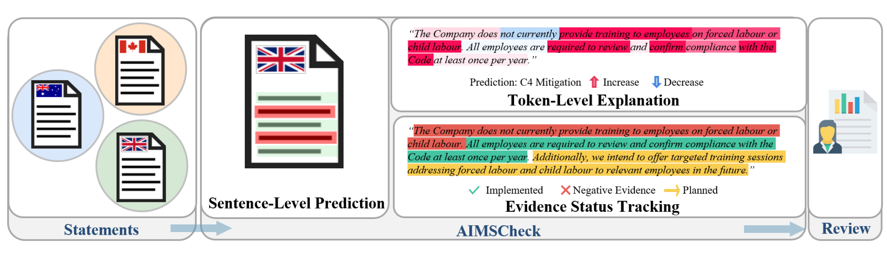
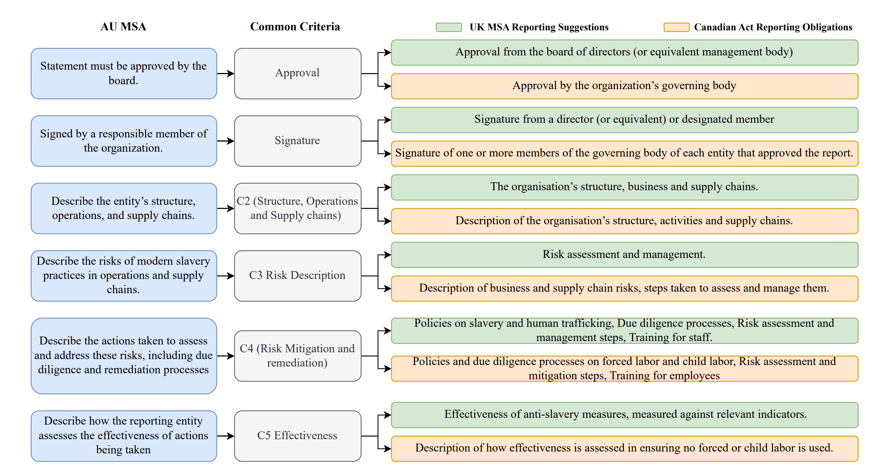

# AIMSCheck — Leveraging LLMs for AI-Assisted Review of Modern Slavery Statements Across Jurisdictions

<p align="left">
  <a href="https://aclanthology.org/2025.acl-long.446"></a>
  <a href="https://arxiv.org/abs/2506.01671"></a>
  <a href="https://doi.org/10.6084/m9.figshare.28489340"></a>
  <a href="../../LICENSE"></a>
</p>

**Venue:** Proceedings of the 63rd Annual Meeting of the Association for Computational Linguistics
(ACL 2025), Vienna — main conference ·
**Anthology:** [2025.acl-long.446](https://aclanthology.org/2025.acl-long.446)

Adriana Eufrosina Bora¹² *, Akshatha Arodi¹ *, Duoyi Zhang², Jordan Bannister¹, Mirko Bronzi¹,
Arsene Fansi Tchango¹, Md Abul Bashar², Richi Nayak², Kerrie Mengersen²
<sub>¹ Mila — Quebec AI Institute · ² Queensland University of Technology · \* equal contribution</sub>

← [Back to Project AIMS](../../README.md)

---

## Overview

[AIMS.au](../aims-au/) showed that fine-tuned models can assess Australian statements. AIMSCheck asks
the two questions that follow: **does it transfer to other jurisdictions**, and **can a compliance
verdict be made reviewable** rather than a black-box yes/no?

Two contributions:

1. **AIMS.uk and AIMS.ca** — newly annotated benchmark datasets from the UK and Canada (50
   expert-annotated statements each), enabling cross-jurisdictional evaluation for the first time.
2. **AIMSCheck** — an end-to-end framework that decomposes compliance assessment into three levels,
   with a human expert making the final call.

The design premise is stated plainly in the paper: a model that emits a binary compliant/non-compliant
label "lacks explainability, accountability, and the nuance needed for meaningful compliance
assessment." Civil society organisations need a process they can audit, not just an answer.

## The three levels



| Level | What it does | How |
|---|---|---|
| **1. Sentence-level prediction** | Classifies each sentence as relevant or irrelevant to each of the 9 reporting criteria | Multi-label binary classification; fine-tuned BERT / Llama 3.2 3B, or GPT-4o / DeepSeek-R1 prompted |
| **2. Token-level explanation** | Shows *which words* drove the decision, so a reviewer can check the model's reasoning | SHAP attributions over the target sentence |
| **3. Evidence status tracking** | Distinguishes an action already taken from a future promise or an explicit denial | NLTK tense classifier for future actions; zero-shot BART-MNLI for negative evidence |

Level 3 is what separates a disclosure that says *"we conducted supplier audits"* from one that says
*"we intend to conduct supplier audits"* or *"we do not currently provide training"* — a distinction
that matters enormously for compliance and that a relevance classifier alone cannot make.

## Cross-jurisdictional mapping



The three Acts target the same problem but word their obligations differently. The project curated a
mapping of AU MSA mandatory criteria against UK MSA reporting suggestions and Canadian Act reporting
obligations, in consultation with domain experts, giving nine shared criteria plus jurisdiction-specific
extras (Canada's *remediation of income loss*; Australia's *reporting entity* and *consultation*).

## Results

Overall F1, averaged across all nine criteria (Table 2). Fine-tuned models on top, prompted below.

| Model | Context words | AIMS.au | AIMS.ca | AIMS.uk |
|---|---:|---:|---:|---:|
| **Llama 3.2 3B** | **100** | **0.738** | **0.719** | **0.686** |
| Llama 3.2 3B | 0 | 0.726 | 0.716 | 0.672 |
| BERT | 100 | 0.719 | 0.700 | 0.669 |
| BERT | 0 | 0.694 | 0.677 | 0.653 |
| GPT-4o CoT (few-shot) | 100 | 0.617 | 0.614 | 0.573 |
| GPT-4o | 100 | 0.601 | 0.582 | 0.542 |
| GPT-4o CoT | 100 | 0.559 | 0.560 | 0.500 |
| DeepSeek-R1 | 100 | 0.548 | 0.550 | 0.505 |

Three findings worth stating directly:

- **Fine-tuning beats prompting by a wide margin.** A 3B fine-tuned model outperforms GPT-4o by
  ~0.12 F1. Domain-specific supervision, not model scale, carries this task.
- **Australian training transfers.** Models trained on AIMS.au lose only ~0.02–0.05 F1 on UK and
  Canadian statements. A Jensen-Shannon divergence analysis of vocabulary explains why: the shift
  between jurisdictions is minor, and concentrated in named entities.
- **Chain-of-thought alone *hurt* GPT-4o** (0.601 → 0.559); it only helped once few-shot examples
  were added (0.617). Prompting strategy is not reliably additive here.

### Per criterion (Llama 3.2 3B, 100-word context)

| Criterion | AU | CA | UK |
|---|---:|---:|---:|
| Approval | 0.864 | 0.947 | 0.783 |
| Signature | 0.790 | 0.816 | 0.686 |
| C2 (supply chains) | 0.805 | 0.656 | 0.704 |
| C2 (operations) | 0.769 | 0.803 | 0.789 |
| C2 (structure) | 0.749 | 0.741 | 0.773 |
| C3 (risk description) | 0.738 | 0.596 | 0.622 |
| C4 (risk mitigation) | 0.669 | 0.674 | 0.646 |
| C4 (remediation) | 0.667 | 0.567 | 0.651 |
| C5 (effectiveness) | 0.592 | 0.526 | 0.525 |

The pattern is consistent and interpretable: near-mechanical criteria (approval, signature) score
high, while criteria requiring judgement about substance — effectiveness, remediation — score
lowest. Those are exactly the criteria where a human reviewer is least replaceable, which is an
argument for the framework's design rather than against its performance.

The paper also reports a calibration analysis showing the fine-tuned model's output probabilities
track true correctness likelihood — so reviewers can use confidence scores to triage, not just the
hard label.

## Applied findings

Running the model across AIMS.uk with company metadata surfaces sector-level patterns: firms in
industry and infrastructure disclose risk less than commerce and healthcare, suggesting weaker
external pressure to be transparent. That is a demonstration of what the tool makes possible at
scale — analysis over thousands of statements rather than dozens.

## Access

| Resource | Location |
|---|---|
| Paper | [ACL Anthology](https://aclanthology.org/2025.acl-long.446) · [arXiv:2506.01671](https://arxiv.org/abs/2506.01671) |
| AIMS.uk / AIMS.ca test sets | [Figshare DOI](https://doi.org/10.6084/m9.figshare.28489340) — `test_uk.csv`, `test_ca.csv` |
| Training data | AIMS.au — see [`../aims-au/`](../aims-au/) |
| Best model weights | Llama 3.2 3B (+100 words) — [Figshare](https://figshare.com/articles/dataset/LLAMA_context_100_weights/29174045?file=54904154) |
| Code | [`../../code/`](../../code/) |

## Reproduce

Set up the shared codebase as described in [`../aims-au/`](../aims-au/#reproduce), then:

**Level 1 — sentence-level prediction.** The best configuration in the paper is LoRA Llama 3.2 3B
with a 100-word context window:

```bash
cd ../../code
python train.py experiment=lora_llama3.2_3b_classif_with_context_100
python test.py  experiment=lora_llama3.2_3b_classif_with_context_100
```

BERT baselines, with and without context:

```bash
python train.py experiment=unfrozen_bert_classif_with_context
python train.py experiment=unfrozen_bert_classif
```

**Cross-jurisdictional evaluation.** Point the test config at the UK or Canadian test set
(`test_uk.csv` / `test_ca.csv` from the [Figshare record](https://doi.org/10.6084/m9.figshare.28489340))
rather than the Australian one. The models are trained on AIMS.au and evaluated zero-shot on the
other jurisdictions — no retraining.

**Level 3 — evidence status tracking.** The future-action and negative-evidence notebooks are in
[`code/notebooks/evidence_tracking/`](../../code/notebooks/evidence_tracking/):

```
Future-identification-UK.ipynb    Negative-evidence-UK.ipynb
Future-identification-CA.ipynb    Negative-evidence-CA.ipynb
```

**Inference on new PDFs.** [`code/notebooks/inference_on_PDFs.ipynb`](../../code/notebooks/inference_on_PDFs.ipynb)
runs the pipeline end to end on a statement PDF. Supporting scripts:

```
code/scripts/pdf_parsing.py                       parse a PDF into sentences
code/scripts/classify_text_in_dataframe.py        run the classifier
code/scripts/evaluate_predictions_in_dataframe.py score predictions
code/scripts/aggregate_statement_predictions.py   roll sentence predictions up to statement level
```

## Citation

```bibtex
@inproceedings{bora2025aimscheck,
  title     = {{AIMSCheck}: Leveraging {LLM}s for {AI}-Assisted Review of Modern Slavery
               Statements Across Jurisdictions},
  author    = {Bora, Adriana Eufrosina and Arodi, Akshatha and Zhang, Duoyi and
               Bannister, Jordan and Bronzi, Mirko and Fansi Tchango, Arsene and
               Bashar, Md Abul and Nayak, Richi and Mengersen, Kerrie},
  booktitle = {Proceedings of the 63rd Annual Meeting of the Association for
               Computational Linguistics (Volume 1: Long Papers)},
  year      = {2025},
  pages     = {9109--9135},
  address   = {Vienna, Austria},
  publisher = {Association for Computational Linguistics},
  doi       = {10.18653/v1/2025.acl-long.446},
  url       = {https://aclanthology.org/2025.acl-long.446/}
}
```

---

## 📄 License and citation

**Licence:** figures and documentation in this folder are [CC-BY-4.0](../../LICENSE); code is
[MIT](../../code/LICENSE). Both permit reuse — including commercial — **on condition that you
give credit**.

**If you use anything from this folder, cite the paper above.** Attribution is a licence condition,
not a courtesy. See the [repository citation guide](../../README.md#-how-to-cite) if you drew on more
than one output.

Figures are reproduced from the paper by its authors.
