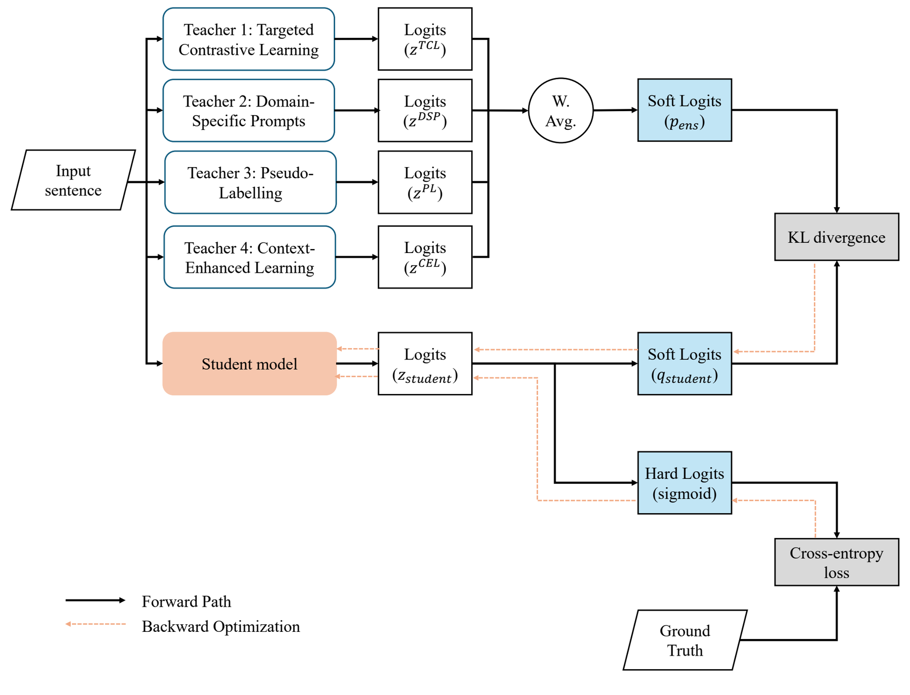
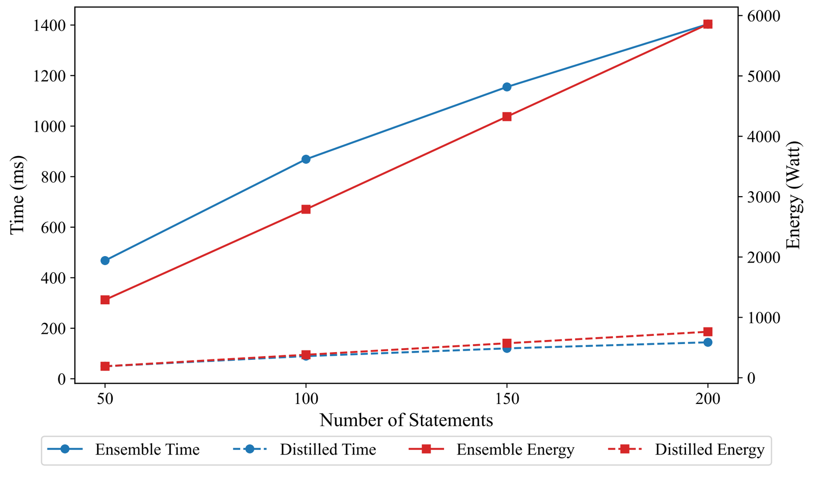
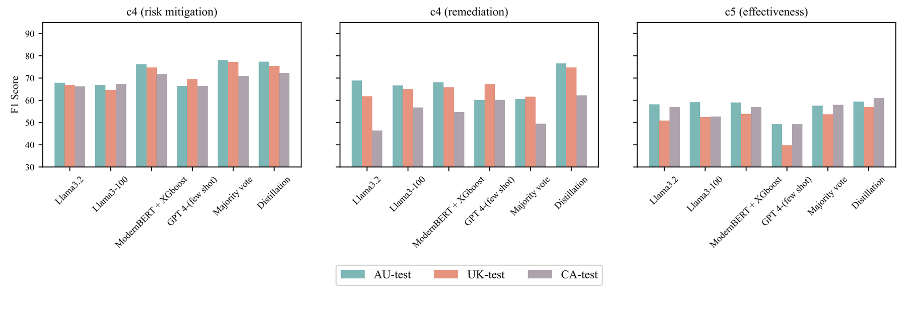

# AIMSDistill — Distilling Knowledge from Specialised AI Teachers for Cross-Jurisdictional Compliance Analysis of Modern Slavery Statements

<p align="left">
  <a href="https://doi.org/10.1016/j.eswa.2026.133691"></a>
  
  <a href="../../LICENSE"></a>
</p>

**Venue:** *Expert Systems with Applications*, vol. 332, art. 133691 (2026) ·
**DOI:** [10.1016/j.eswa.2026.133691](https://doi.org/10.1016/j.eswa.2026.133691)

Adriana Eufrosina Bora¹² *, Duoyi Zhang³ *, Md Abul Bashar³, Richi Nayak³, Kerrie Mengersen¹

<sub>¹ School of Mathematical Sciences, QUT · ² Mila — Quebec AI Institute · ³ School of Computer Science, QUT · \* equal contribution </sub>

← [Back to Project AIMS](../../README.md)

---

## Overview

[AIMS.au](../aims-au/) and [AIMSCheck](../aimscheck/) showed that fine-tuned models can assess
compliance with modern slavery legislation — but the best performers are large. That is a problem
for the organisations that actually need them: government agencies and CSOs reviewing statements
typically work under tight compute budgets, and over **90,000 statements** now sit across the UK,
Australian, and Canadian registries (as of March 2025).

AIMSDistill closes that gap. Four **specialised teacher models** are trained, each correcting a
distinct failure mode of the previous generation, then ensembled and **distilled into a single
340M-parameter ModernBERT student**. The student is not merely a cheap approximation of the
ensemble — it *outperforms* it on the Australian and UK test sets while running roughly **8× faster
on ~6% of the parameters**.

The student model is now the evidence-retrieval backbone (Agent 1) of [AIMS-QA](../aimsqa/).



<sub>Four specialised teachers are trained independently, their logits combined by weighted average
into an ensemble soft target, and a single student is trained against both that soft target
(KL-divergence) and the ground truth (cross-entropy). Figure 4 from the paper.</sub>

## The four teachers

| # | Teacher | Strategy | Backbone | What it fixes |
|---|---|---|---|---|
| 1 | **TCL** | Targeted contrastive learning | ModernBERT-large ×3 | Confusable criteria pairs identified by error analysis in AIMSCheck |
| 2 | **DSP** | Jurisdiction-specific prompt tuning | LLaMA 3.2–1B | Injects legislation-specific semantics per jurisdiction |
| 3 | **PL** | Pseudo-labelling on unlabelled statements | LLaMA 3.2–3B | Cross-jurisdictional generalisation from unlabelled registry data |
| 4 | **CEL** | Context-enhanced learning (LLaMA100, from [AIMSCheck](../aimscheck/)) | LLaMA 3–3B | Surrounding-sentence context (e.g. resolving `signature` from "signed by") |

Teacher logits are combined by weighted average; the student is trained on a composite loss —
KL-divergence against the ensemble's soft targets plus cross-entropy against ground truth. The
combination weights are treated as tunable hyperparameters, which the ablation shows beats
entropy- and accuracy-weighted schemes.

## Task

Sentence-level **multi-label** classification: for each sentence, predict which of **11 reporting
criteria** it addresses — `approval`, `signature`, `c1 (reporting entity)`, `c2 (structure)`,
`c2 (operations)`, `c2 (supply chains)`, `c3 (risk description)`, `c4 (risk mitigation)`,
`c4 (remediation)`, `c5 (effectiveness)`, `c6 (consultation)`.

`c1` and `c6` are Australia-only, so they are absent from the UK and CA test sets.

## Data

| | AIMS.au (train) | AU-test | UK-test | CA-test |
|---|---|---|---|---|
| Statements | 4,306 | 50 | 50 | 50 |
| Sentences | 750,021 | 4,795 | 2,872 | 3,658 |

| Unlabelled (pseudo-labelling) | AU | UK | CA |
|---|---|---|---|
| Statements | 6,381 | 39,343 | 5,546 |
| Sentences | 747,947 | 2,718,554 | 15,763 |

Labels are heavily imbalanced — `c4 (risk mitigation)` covers 20.0% of training sentences, while
`c6 (consultation)` covers 0.66%.

## Results

Aggregated macro-F1 (Table 6). **Bold** = best.

| Type | Method | Params | AU-test | UK-test | CA-test |
|---|---|---:|---:|---:|---:|
| Prev. SOTA | LegalBERT | 110M | 54.26 | 49.37 | 51.77 |
| Prev. SOTA | BERT100 | 110M | 70.83 | 66.93 | 70.01 |
| Prev. SOTA | LLaMA100 *(= Teacher 4)* | 3B | 71.25 | 68.58 | 71.91 |
| Prompting | GPT CoT | ≈1T | 55.90 | 50.00 | 56.00 |
| Prompting | GPT CoT few-shot | ≈1T | 61.70 | 57.30 | 61.40 |
| Fine-tuned | ModernBERT | 340M | 69.64 | 65.03 | 67.53 |
| Fine-tuned | LLaMA-1B | 1B | 68.00 | 66.09 | 65.06 |
| Fine-tuned | LLaMA-3B | 3B | 70.48 | 67.83 | 67.79 |
| Ensemble | ModernBERT + XGBoost | 340M | 71.96 | 68.44 | 69.24 |
| Ensemble | LLaMA + XGBoost | 3B | 69.18 | 68.37 | 67.44 |
| Proposed | Contrastive *(Teacher 1)* | 340M ×3 | 70.24 | 66.17 | 68.53 |
| Proposed | Domain-specific prompts *(Teacher 2)* | 1B | 70.96 | 67.52 | 69.14 |
| Proposed | Pseudo-label *(Teacher 3)* | 3B | 72.83 | 71.37 | 72.67 |
| **Proposed** | **Distilled student** | **340M** | **73.12** | **72.44** | **72.95** |

Two results worth pulling out:

- **Prompting large general models is not competitive.** GPT with chain-of-thought scores below
  62 macro-F1 everywhere — 11+ points behind a 340M fine-tuned student. Domain-specific supervised
  training, not model scale, is what carries this task.
- **The student beats the ensemble it was distilled from**, on 2 of 3 jurisdictions (Table 7):

| Method | Params | AU-test | UK-test | CA-test |
|---|---:|---:|---:|---:|
| Equally-weighted ensemble of teachers | ≈8B | 72.93 | 70.11 | **73.09** |
| Accuracy-weighted ensemble of teachers | ≈8B | 72.94 | 70.11 | **73.09** |
| **Distilled student** | **340M** | **73.12** | **72.44** | 72.95 |

### Efficiency



<sub>Solid lines are the ≈8B teacher ensemble, dashed are the 340M student. Both time (left axis)
and energy (right axis) diverge sharply as volume grows. Figure 7 from the paper.</sub>

Under a 10 GB GPU constraint (typical of a government agency), the teacher ensemble must run
sequentially; the student needs one forward pass. Over 200 statements:

| | Ensemble (≈8B) | Distilled student (340M) |
|---|---|---|
| Processing time | ~1,400 ms | ~180 ms |
| Energy | >5,800 W | <1,000 W |

≈ **8× faster, ≈ 6× less energy**, and the gap widens with volume. (Units follow Figure 7 of the
paper.)



<sub>Per-criterion F1 for each model across the three jurisdictions. The distilled student rivals or
beats much larger models on most criteria despite its size. Figure 6 from the paper.</sub>

### Ablation — distillation strategy (Table 8)

| Strategy | AU-test | UK-test | CA-test |
|---|---:|---:|---:|
| Average distillation | 72.13 | 72.00 | 70.51 |
| Contrastive only | 71.59 | 70.08 | 70.48 |
| Prompt only | 71.53 | 70.91 | 68.79 |
| Pseudo-labelling only | 71.28 | 70.84 | 68.66 |
| Domain-specific prompts only | 71.54 | 71.78 | 70.17 |
| Accuracy-weighted | 71.47 | 72.37 | 70.50 |
| Entropy-weighted | 72.02 | 72.09 | 70.31 |
| **Tunable weights (proposed)** | **73.12** | **72.42** | **72.38** |

No single teacher is sufficient, and principled weighting schemes do not beat tuned weights.

## Limitations (stated by the authors)

- Validated on a subset of AU, UK, and CA statements only — no comprehensive ground truth exists.
- All three jurisdictions are **English-language**; non-English performance is untested.
- Intended to **support, not replace** human review; expert validation of explanations is expected.
- Teacher combination weights are tuned manually; gating or adaptive networks are future work.

## Access

| Resource | Location |
|---|---|
| Code | [`github.com/Duoyi1/AimsDistill-paper`](https://github.com/Duoyi1/AimsDistill-paper) — the location cited in the paper (footnote 3) |
| Student weights | [Figshare DOI 10.6084/m9.figshare.33261576](https://doi.org/10.6084/m9.figshare.33261576) — `au.pth`, `uk.pth`, `ca.pth`, 1.47 GB each |
| Teacher logits | [`logits.zip`](https://doi.org/10.6084/m9.figshare.33261576) — 325 MB, in the same record |
| Training data | AIMS.au — [Hugging Face](https://huggingface.co/datasets/mila-ai4h/AIMS.au) · see [`../aims-au/`](../aims-au/) |
| Test data | AIMS.uk / AIMS.ca — see [`../aimscheck/`](../aimscheck/) |

**Three students, one per jurisdiction.** Table 5 of the paper gives separate hyperparameters for
AU, UK, and CA (learning rate, epochs, temperature, β), and the released weights match: `au.pth`,
`uk.pth`, and `ca.pth`. The macro-F1 figures above are each from the student trained for that
jurisdiction. `au.pth` is also the classifier behind [AIMS-QA](../aimsqa/)'s Agent 1 — same 1.47 GB
artefact, so publishing it once serves both papers.

> **Note on hosting.** The weights are archived on Figshare with a DOI. The code is on a
> personal GitHub account, so it has no DOI — keep that URL alive, it is what the published
> paper cites.
> 
## Citation

```bibtex
@article{bora2026aimsdistill,
  title   = {{AIMSDistill}: Distilling Knowledge from Specialised {AI} Teachers for
             Cross-Jurisdictional Compliance Analysis of Modern Slavery Statements},
  author  = {Bora, Adriana Eufrosina and Zhang, Duoyi and Bashar, Md Abul and
             Nayak, Richi and Mengersen, Kerrie},
  journal = {Expert Systems with Applications},
  volume  = {332},
  pages   = {133691},
  year    = {2026},
  issn    = {0957-4174},
  doi     = {10.1016/j.eswa.2026.133691}
}
```

---

## 📄 License and citation

**Licence:** figures and documentation in this folder are [CC-BY-4.0](../../LICENSE); code is
[MIT](../../code/LICENSE). Both permit reuse — including commercial — **on condition that you
give credit**.

**If you use anything from this folder, cite the paper above.** Attribution is a licence condition,
not a courtesy. See the [repository citation guide](../../README.md#-how-to-cite) if you drew on more
than one output.

Figures are reproduced from the paper by its authors.

---

> **Spelling:** the published title uses **AIMSDistill** (double *l*). Standardise on that
> everywhere; earlier repository prose used "AIMSDistil".
