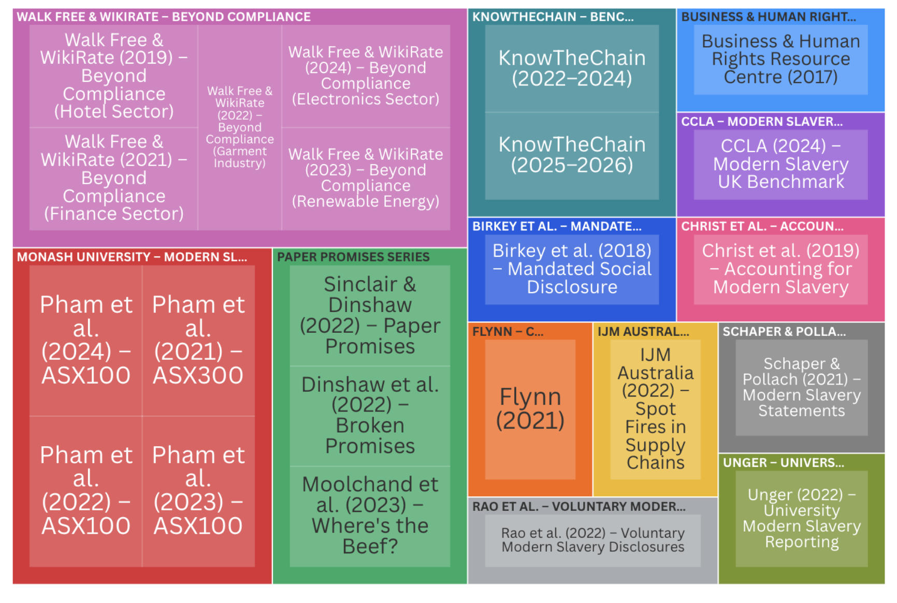
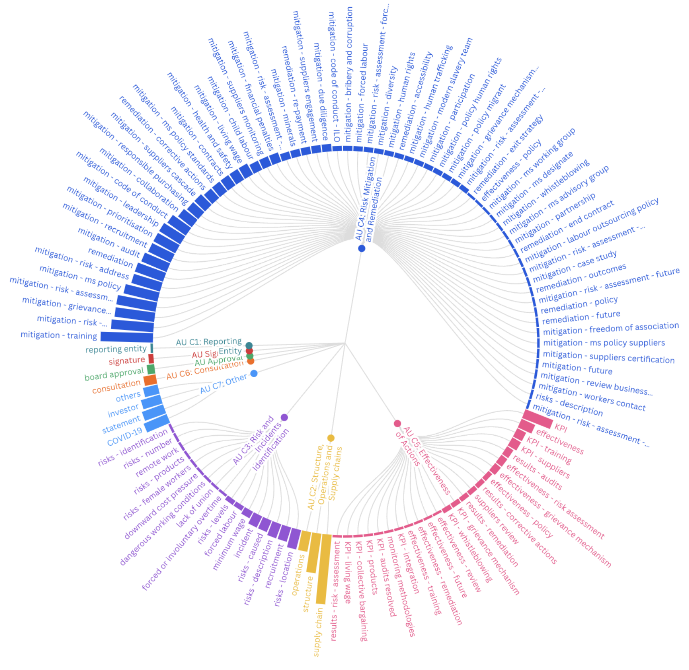
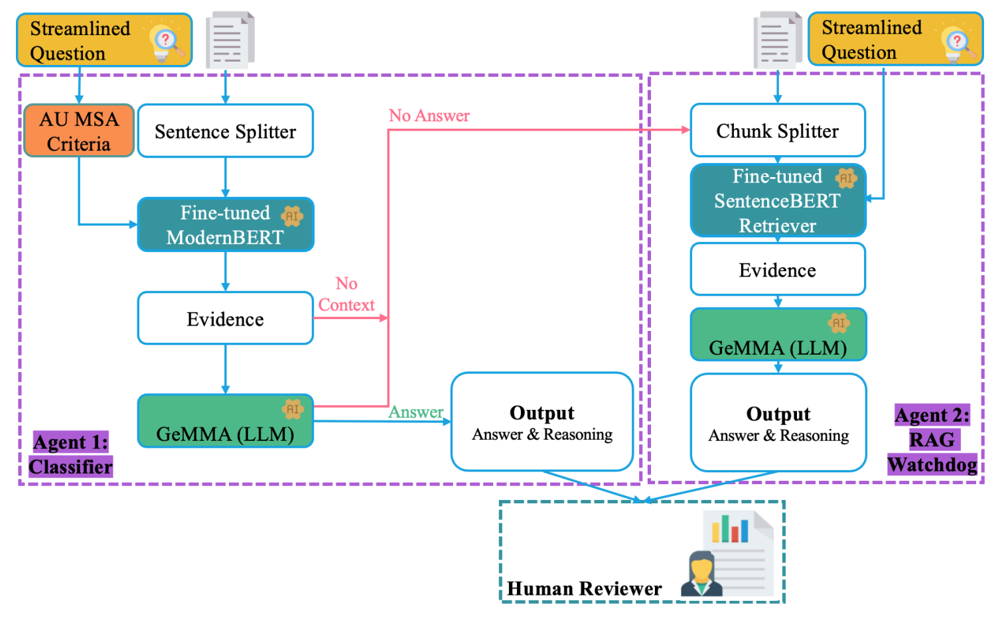
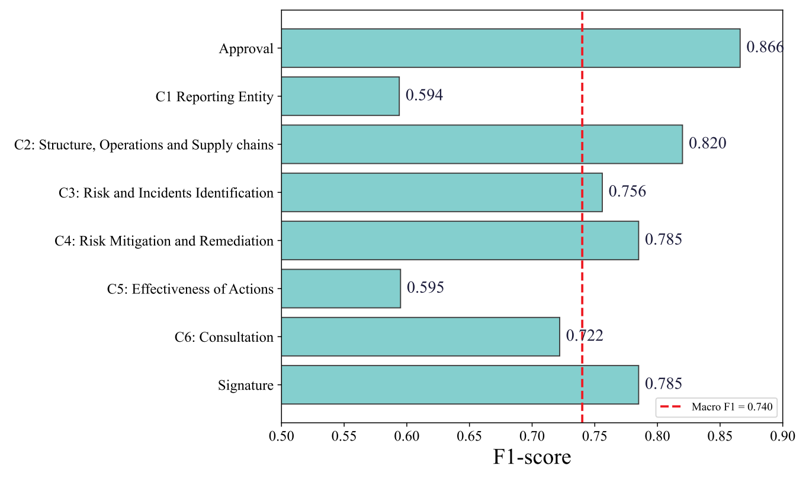

# AIMS-QA — Scaling the Assessment of Corporate Modern Slavery Statements Beyond Compliance with AI-Driven Question Answering

<p align="left">
  
  
  <a href="../../LICENSE"></a>
</p>

**Venue:** *Data & Policy* (Cambridge University Press), Data for Policy conference paper, 2026 ·
**DOI:** *TODO: add once Cambridge assigns it*

Adriana Eufrosina Bora¹², Duoyi Zhang², Hannah Thinyane³, Md Abul Bashar², Richi Nayak², Kerrie Mengersen²

<sub>¹ Mila — Quebec AI Institute · ² Queensland University of Technology · ³ Diginex Ltd</sub>

← [Back to Project AIMS](../../README.md)

---

## Overview

Every earlier output in this project answers one question: *does this statement contain the things
the law requires?* That is compliance checking, and it has a ceiling — a statement can satisfy every
mandatory criterion and still say nothing meaningful about whether the company is actually reducing
harm.

AIMS-QA is built to go past that ceiling. It replaces binary compliance classification with a
**two-stage question-answering pipeline** that interrogates a statement with structured, evidence-grounded
questions, and it is backed by a taxonomy built from how the field *already* evaluates disclosures.

## The taxonomy

The paper's first contribution is a systematic synthesis of the modern slavery disclosure
benchmarking landscape:



<sub>The 13 source methodologies synthesised into the taxonomy. Figure 2 from the paper.</sub>

```
13 benchmarking methodologies   (academic + civil society)
        ↓
473 individual metrics
        ↓
209 streamlined questions
        ↓
115 thematic topics
        ↓
37-question priority framework
```



<sub>Every metric mapped to an AU MSA criterion and an emergent thematic topic. Bar length shows how
many source methodologies use each topic — C4 (risk mitigation and remediation) dominates. Figure 3
from the paper.</sub>

Every question is mapped to one of the **seven AU MSA reporting criteria** — chosen as the analytic
backbone for two stated reasons: the Australian Act has the most mature body of statements, and the
underlying classifier is trained on AIMS.au, whose annotations already align to those criteria.

Each question is tagged as either a **statutory baseline obligation** or a **beyond-compliance
indicator**. That two-tier design is the analytical core: it lets a reviewer separate *"this company
broke a legal duty"* from *"this company is behind good practice"* — two findings with very different
consequences that a single compliance score collapses together.

The 37-question priority framework selects the indicators appearing across the most methodologies,
while retaining every statutory baseline regardless of convergence — because failing a legal duty
signals possible non-compliance, not merely a gap versus best practice.

## The pipeline



<sub>Agent 1 classifies sentences against AU MSA criteria and answers from the retrieved evidence.
When it cannot ground an answer, control passes to Agent 2, which re-retrieves at question level.
Both route to a human reviewer. Figure 4 from the paper.</sub>

Two cooperating agents, run sequentially rather than in parallel:

| | Agent | Role | Model |
|---|---|---|---|
| **1** | **Classifier** | Evidence extraction. Splits the statement into sentences, identifies those relevant to a criterion, and passes each with ±100 tokens of surrounding context to the LLM for an answer plus reasoning. | Fine-tuned ModernBERT ([AIMSDistill](../aimsdistill/) student) + Gemma-27B |
| **2** | **RAG Watchdog** | Fallback. Triggered only when Agent 1 cannot ground a sufficiently supported answer — re-encodes the whole statement, retrieves at *question* level rather than criterion level, and re-answers. | SentenceBERT retriever + Gemma-27B |

The sequencing is a deliberate cost/precision trade-off, and the paper argues it explicitly: running
the Watchdog on every question would require re-encoding every statement and an extra Gemma-27B pass,
without improving recall on the cases Agent 1 already handles confidently.

Agent 1 retrieves at the **criterion** level, deliberately coarser than the question level — Agent 2's
finer-grained retrieval is what complements it.

## Results

Evaluated on **185 question instances** — the 37 priority questions applied to each of 5 statements
drawn at random from the AIMS.au test set. Note this is an exploratory evaluation, not a
statistically representative sample.

**System vs. expert agreement**

| Answer source | vs. Expert 1 | vs. Expert 2 | N |
|---|---:|---:|---:|
| Agent 1 (Classifier) | 0.847 | 0.909 | 177 |
| Agent 2 (RAG Watchdog) | 0.625 | 1.000 | 8 |
| **Overall** | **0.838** | **0.913** | **185** |

**By criterion**

| Criterion | vs. Expert 1 | vs. Expert 2 |
|---|---:|---:|
| Signature | 1.000 | 1.000 |
| C2: Structure, Operations and Supply chains | 0.971 | 1.000 |
| C3: Risk and Incidents Identification | 0.833 | 0.967 |
| C4: Risk Mitigation and Remediation | 0.788 | 0.847 |
| C5: Effectiveness of Actions | 0.733 | 0.933 |
| C6: Consultation | 0.600 | 0.800 |



<sub>Agent 1's classifier on the AIMS.au test set, by mandatory criterion. Figure 6 from the paper.</sub>

**Underlying classifier (Agent 1) on the AIMS.au test set:** macro F1 **0.740** across the mandatory
compliance tasks — Approval 0.866, C1 0.594, C2 0.820, C3 0.756, C4 0.785, C5 0.595, C6 0.722,
Signature 0.785.

> The 0.740 figure groups eight criteria and is not comparable with the 11-label macro-F1 reported in
> [AIMSDistill](../aimsdistill/). Different groupings, different evaluations.

The gap between the two experts (0.838 vs 0.913) is itself informative: expert reviewers disagree
with each other on these judgements, which sets a realistic ceiling on what any automated system can
be measured against.

## Access

| Resource | Location |
|---|---|
| Code | [`src/`](src/) — cleaned end-to-end pipeline |
| Question taxonomy | 37-question priority framework in [`src/data/questions.csv`](src/data/questions.csv). The full 209-question taxonomy is not published — contact the corresponding author. |
| Agent 1 classifier weights | [Figshare DOI 10.6084/m9.figshare.33261576](https://doi.org/10.6084/m9.figshare.33261576) — `au.pth`, 1.47 GB, the [AIMSDistill](../aimsdistill/) Australian student |
| Agent 2 retriever weights | [Figshare DOI 10.6084/m9.figshare.33261639](https://doi.org/10.6084/m9.figshare.33261639) — 80 MB zip, complete SentenceTransformer directory |
| Statement data | AIMS.au — see [`../aims-au/`](../aims-au/) |

> **The taxonomy deserves its own file.** The 209-question table is the artefact other researchers
> and CSOs are most likely to reuse, and right now it exists only inside a PDF appendix. Publishing
> it as CSV in this folder costs nothing and is probably the highest-value thing in the repository
> for downstream users.

## Reproduce

```bash
cd src
python -m venv .venv && source .venv/bin/activate
pip install -r requirements.txt
python download_models.py          # reports which weights you still need
ollama pull gemma3:27b             # install and start Ollama separately first
python pipeline.py --statement-id 12532
```

Fast smoke test before a long run:

```bash
python pipeline.py --statement-id 248 --max-questions 3 --llm gemma3:1b \
  --output outputs/smoke_test.csv
```

Omit `--statement-id` to run the full dataset. Use `--device cpu|cuda|mps` to override automatic
device selection. Python 3.10+ required.

**Reproducibility settings:** classifier threshold 0.7 · two-sentence context window either side ·
SentenceBERT fallback uses five-sentence chunks, stride 2, top-3 retrieval · LLM temperature 0.0 ·
unparseable answers retried up to five times before falling back to retrieved contexts.

## Citation

```bibtex
@article{bora2026aimsqa,
  title   = {{AIMS-QA}: A Framework for Scaling Beyond Compliance the Assessment of Corporate
             Modern Slavery Statements with {AI}-driven Question Answering},
  author  = {Bora, Adriana Eufrosina and Zhang, Duoyi and Thinyane, Hannah and
             Bashar, Md Abul and Nayak, Richi and Mengersen, Kerrie},
  journal = {Data \& Policy},
  year    = {2026},
  note    = {Data for Policy conference paper, Cambridge University Press}
}
```

---

## 📄 License and citation

**Licence:** figures and documentation in this folder are [CC-BY-4.0](../../LICENSE); code is
[MIT](../../code/LICENSE). Both permit reuse — including commercial — **on condition that you
give credit**.

**If you use anything from this folder, cite the paper above.** Attribution is a licence condition,
not a courtesy. See the [repository citation guide](../../README.md#-how-to-cite) if you drew on more
than one output.

Figures are reproduced from the paper by its authors.
